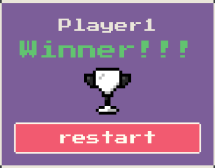

<p align="center">
  
</p>

<p align="center">
  <a href="#-technologies">Technologies</a>&nbsp;&nbsp;&nbsp;|&nbsp;&nbsp;&nbsp;
  <a href="#-getting-started">Getting started</a>&nbsp;&nbsp;&nbsp;|&nbsp;&nbsp;&nbsp;
  <a href="#-project">Project</a>&nbsp;&nbsp;&nbsp;|&nbsp;&nbsp;&nbsp;
  <a href="#-next-steps">Next steps</a>
</p>

<h1 align="center">
  <a href="#" target="_blank">
    Matching Game | Javascript
  </a>
</h1>

---

## 🧪 Technologies

This project was developed using the following technologies:

- [Node](https://nodejs.org/)
- [Vite](https://vitejs.dev/)

## 🚀 Getting started

This project use **node 16.4.2** and **npm 7.18.1**. I recommend installing [NVM](https://github.com/nvm-sh/nvm) on your machine to change node versions more easily and make better use of this project.

Clone the project and access the folder

```bash
$ git clone https://github.com/eltonsantos/matching-game.git && cd matching-game
```

Follow the steps below
```bash
# Install the dependencies
$ npm install

# Start server
$ npm run dev

```

## 💻 Project

Matching game developed during the course on Javascript for React on youtube by instructor Marco Bruno. [Click here](https://www.youtube.com/watch?v=aUDgoPsrPNg&list=PLirko8T4cEmzWZVn_ZKQbfDOuCnSZJ4va) to access the course.


## 🐾 Next steps

###### Escreverei essa parte em português

- [ ] Implementar o dark mode para os olhos agradecerem 😎
- [ ] E muito mais... ❤💪🏼

---

## 👨🏻‍💻 Author

<h3 align="center">
  
  <br/>
  <strong>Elton Santos</strong> 🚀
  <br/>
  <br/>

 <a href="https://www.linkedin.com/in/eltonmelosantos" alt="LinkedIn" target="blank">
    
  </a>

  <a href="mailto:elton.melo.santos@gmail.com?subject=Olá%20Elton" alt="Email" target="blank">
    
  </a>

<br/>

Made with ❤️ by Elton Santos 👋🏽 [Entre em contato!](https://www.linkedin.com/in/eltonmelosantos/)

</h3>